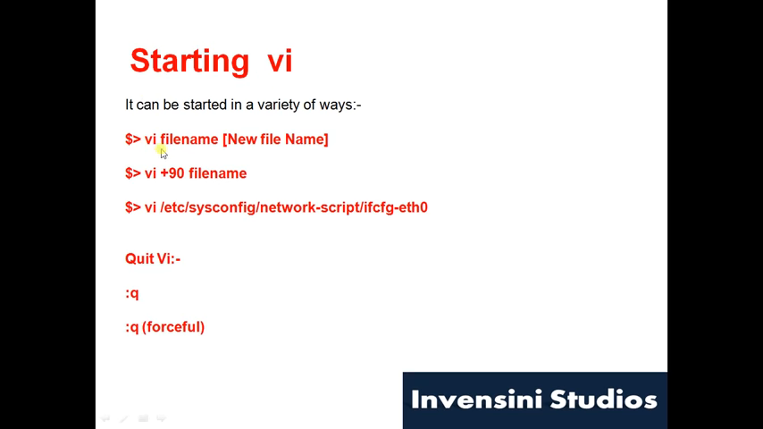

### vi  file 
vi file.txt

- file
- sec
  - ggg
    1. fasfasfa

[link](https://www.github.com)

this paragraph has some `variable` inline

```html
<p>fasf</p>
```tsts
```





someparagraph wiht text

>blockquotefasfsafas  dfasfas

| heading | header | 
| --- | --- |
| fasfas | asfsa |
| fsafsadf | fasfasd |


